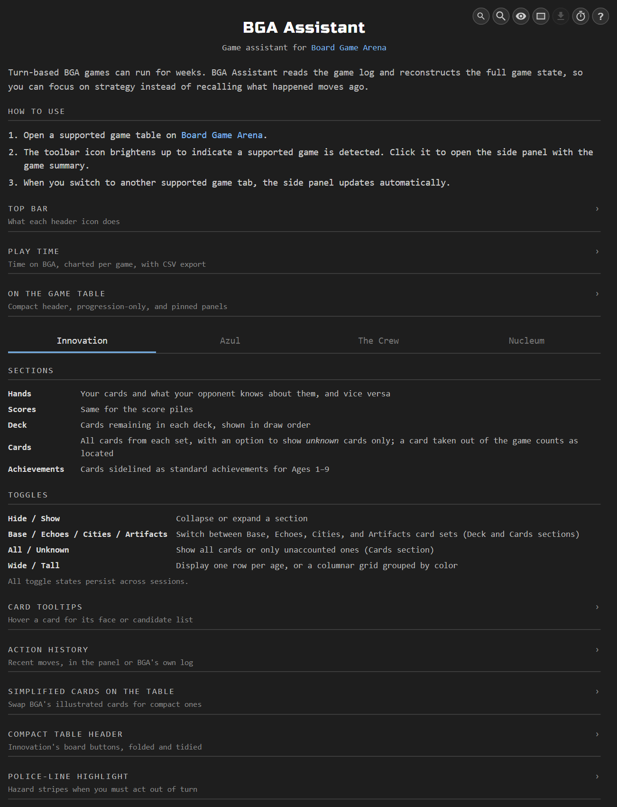

BGA Assistant adds a live side panel to supported game tables, reconstructing hidden information from the public game log — and, where a game hides nothing, reading that log back as a turn-by-turn record. Four games have dedicated trackers — pick one below for its full feature list and screenshots.

## Using the side panel

1. Navigate to a supported BGA game page — the toolbar icon brightens up to indicate a supported game is detected
2. Click the BGA Assistant icon in the toolbar to open the side panel with a visual summary of the game state
3. While viewing a game, the side panel automatically updates when the game progresses
4. Switching to another supported game tab automatically updates the display
5. Click the "?" icon for a built-in help page with a detailed guide on each game's sections, toggles, and controls

