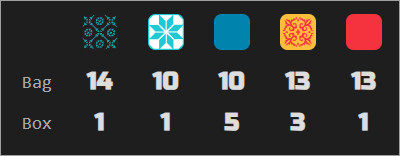

Tracks the tile bag and discard pile (box lid) for [Azul](https://boardgamegeek.com/boardgame/230802/azul) tables with any player count. Particularly helpful in 2-player games where the full bag is depleted in exactly 5 rounds. Displays remaining tile counts per color in a compact table so you always know what's left to draw.

The side panel shows bag and box counts for each of the five tile colors, updating live as tiles are drawn and placed:

## Game features

- **Bag and box tracking**: shows how many tiles of each color remain in the bag and the box lid (discard pile)
- **Refill detection**: annotates when the bag was refilled from the box mid-round
- **Shimmer toggle**: display option to enable or disable the tile shimmer animation (persisted across sessions)

## Standard features

- **Live tracking**: while the side panel is open, the display automatically updates when the game progresses — a green status dot appears in the status bar
- **Auto-update**: while the side panel is open, switching to another supported game tab automatically extracts and displays its state
- **Status bar**: shows the table number and live tracking indicator
- **Auto-hide**: three-mode toggle controlling side panel behavior — Never (always open), Leaving BGA (closes on non-BGA tabs), Leaving tables (closes when navigating away from supported game tables)
- **Keyboard shortcut**: configurable via `chrome://extensions/shortcuts` to toggle the side panel open/closed
- **Lit icon**: the toolbar icon glows when the active tab has a supported game table open
- **Per-game zoom**: side panel zoom level is saved independently for each game and the help page
- **Compact BGA header**: folds BGA's table info, the current prompt and its action buttons into a single row and trims the bar to fit, reclaiming the vertical space its three stacked rows took; applies to every BGA table, supported game or not, stays frozen at the top while the board scrolls; it is switched from the eye menu on the help page, which also offers "Progression only" — the table number and move count dropped, leaving the percentage in the prompt's own type
- **Pin player panels**: keeps the top of BGA's right column in place while the board scrolls past — under the folded header bar when it is frozen, at the top of the page when it is not. While the turn history is showing in BGA's log column the whole column is pinned, history and view switch included, and scrolls inside itself if it outgrows the window; otherwise the player panels alone are pinned and BGA's log column scrolls away as usual, and panels tall enough to take half the window are left alone. Switched from the eye menu on the help page, and applies to every BGA table, supported game or not
- **Persistent settings**: all toggle states, section visibility, and pin mode are saved across sessions
- **Download**: bundled zip with raw data, game log, game state, and standalone summary — attach this archive with a short description if you notice a bug, and I'll prioritize fixing it!
