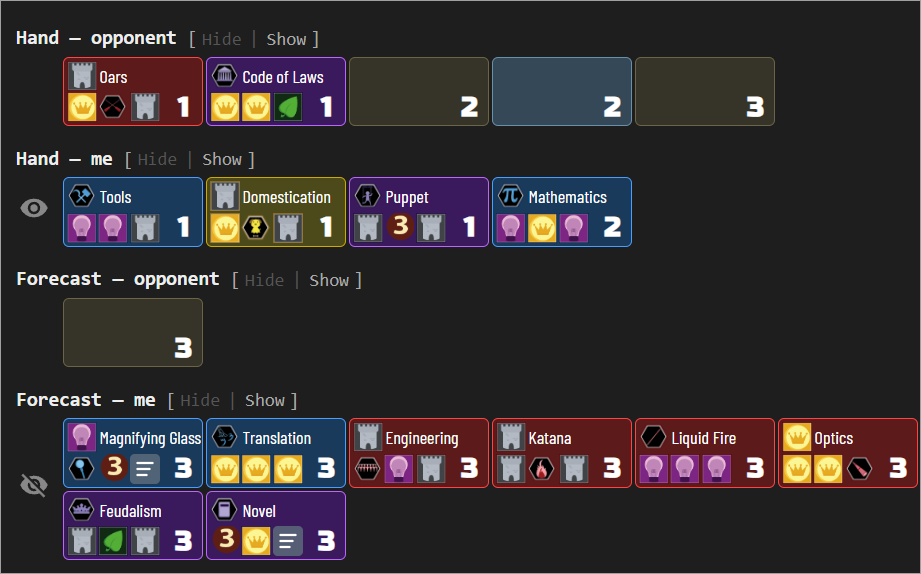
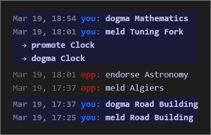
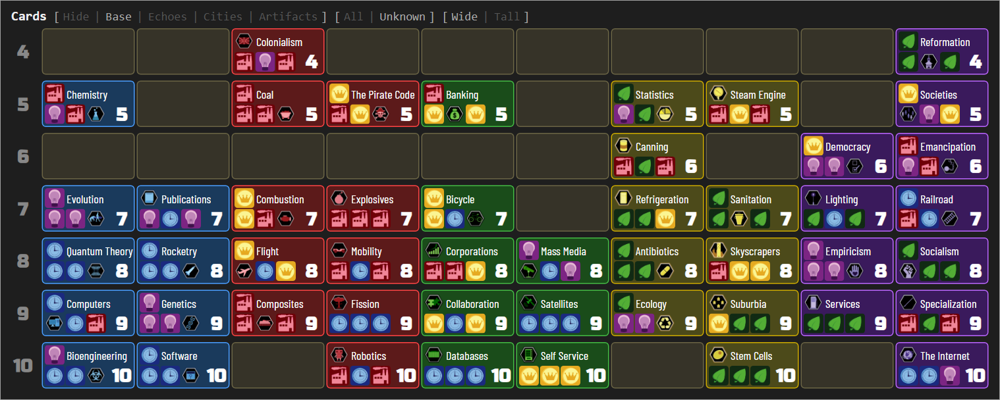
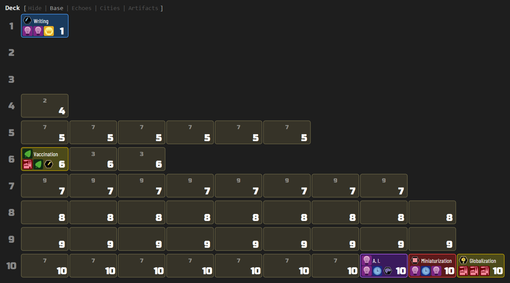

Reads the full game log from [Innovation](https://boardgamegeek.com/boardgame/63888/innovation) 2-player tables and reconstructs the game state — hand contents and score piles according to revealed cards, and deck stack order with returned cards — displayed as a visual summary in a side panel. Supports the base game and the Echoes of the Past, Cities of Destiny, and Artifacts of History expansions (including the Relics variant).

## Hands, forecast and score

Each of those sections shows known cards with their name, icons, and age, while unknown cards appear as placeholders with just the age number and set. Once an unknown card has been narrowed below its full age group, it also shows the number of remaining candidates, and hovering reveals every card it could still be as mini icons. An eye icon represents opponent's knowledge:

## Turn history

A compact sidebar shows recent actions — meld, draw, dogma, endorse, achieve, promote — with timestamps and player attribution. Each player's row is rendered in their actual BGA-assigned color, and your own ("you") row is highlighted with a subtle background tint of that color so it stays distinguishable regardless of which color BGA gave you. Compound actions (e.g. meld → promote → dogma) render as indented sub-action lines. Turns that begin with an Artifact on display show the pre-turn choice (pass, return, or dogma of that Artifact) as an italicized line above the regular actions:

### In the BGA game log

The same turn history can render directly in BGA's own log column instead of the side panel, where it stays visible and keeps updating with the panel closed. Enable it from the eye menu with "Show in BGA game log". The in-page version reads newest-first to match BGA's log, shows the same action lines as the panel, and timestamps them with the time only — rows wrap in BGA's narrow column, and the date would cost a line. Card names keep their hover tooltips.

The column shows one log or the other, never both. A lightbulb in the header switches between them — lit while the turn history is up, dim while BGA's log is — so neither list is out of reach with the side panel closed. "More..." at the foot of the history widens the window beyond the default nine half-turns, and disappears once the whole game is shown. Both that and the switch are temporary: they last for the table you're on, and a reload or a different table starts from the eye-menu setting again.

## Simplified cards on the table

The side panel's compact card can replace BGA's illustrated one on the table itself. Enable it from
the eye menu with "Simplified cards on BGA's table". It covers your hand and every player's board —
the three places Innovation shows cards face up at full size.

A simplified card drops the illustration and the dogma text, keeping the flat colour of its own
colour pile, the card's icons, its name and its age. The rules text is still a hover away on BGA's
own tooltip. Cards shrink to roughly a quarter of their former area, so a board that used to need
scrolling tends to fit the window.

The top card of a pile — and every card in your hand, which is never stacked — uses the side panel's
layout, spot for spot: the card's first icon top-left, the rest along the bottom, the name across the
top, and the age in the bottom-right corner. Cities cards use all six icon spots and so show no name,
exactly as they do in the panel.

Cards underneath the top one use a second layout, because a splay leaves them showing only a strip
and the icons in that strip are the point of splaying. There they take the real card's geometry: the
right-hand icons move out to the right-hand edge and the age moves inboard to the space they leave.
So splaying left reveals the card's last icon (and on a Cities card the top-right one too), splaying
right reveals the two left-hand icons, and splaying up reveals the whole bottom row — each exactly as
on BGA's own cards.

The age needs no rule of its own. On a covered card it sits inboard of both side strips, so a pile
splayed left or right hides it without being told to, while a pile splayed up reveals the whole
bottom row and brings it along. The top card is never covered, so it always shows its age.

A **Size** slider under the checkbox scales the cards from 100% to 200% in 10% steps. The whole card
scales as one — box, icons, name and age together — and so does the strip a splay reveals, so a
splayed pile reads the same at every size.

Card names are shown in their own capitalisation, as in the side panel. BGA writes them into the page
already uppercased, so the extension puts the original back from the game's own card data; that also
means a table played in another language keeps its translated names.

Only your own hand changes: opponents' hands are face-down cards, and the score piles, achievements
and decks are drawn edge-on, with nothing on them to simplify. The artifact display and revealed
cards keep BGA's artwork.

Note that BGA has a simplified card layout of its own, under its game preferences. That one swaps
the illustration for a plain background at the usual card size; this one is a different, denser
card, and does not need BGA's setting on.

## Compact table header

This one is not Innovation's alone — the header it folds is BGA's own framework, identical on every
table, so it applies to every game on the site, supported here or not. It is switched from the eye
menu on the help page — the one place it lives, since it belongs to no single game. What follows
describes it on an Innovation table, where a few of the game's own controls are handled too.

BGA's table page spends three rows on its header: the table id, move number and progression sit in
the topbar, the current prompt and its action buttons in a bar of their own below it, and
Innovation's board buttons in a third row under that. This folds all of it into one — the prompt and
its buttons move up into the topbar beside the table info, and the bar they came from goes away,
leaving that much more of the window for the board. The remaining bar is trimmed as well: a smaller
site logo and tighter leading let it shrink to the height its contents actually need — 36 pixels
against BGA's fixed 62 — and the whitespace below it drops from 18 pixels to 5, which also brings
the two columns back into line with each other.

Two of Innovation's board buttons are hidden along the way: "Show compact", which only changes how
far splayed stacks overlap, and "Browse all cards", which duplicates what the side panel's card list
already shows. BGA's "This player is not playing: what can I do?" link is hidden too, so a stalled
opponent costs no header space.

"Look at all cards in piles" stays, redrawn as an eye icon in the left corner between the site logo
and the table info — it toggles what you see rather than doing anything in the game, so it is dimmed
until you hover it. BGA's go-to-next-table control goes the other way, out of the prompt and over to
the far right to join the sound, fullscreen and menu icons. It sits there rather than in the left
corner because it is not always the small arrow it looks like mid-turn: once your turn ends and other
tables are waiting, BGA relabels it "N tables are waiting for you" — a notice rather than a control,
so it keeps its full strength.

Everything else in the topbar keeps its place — the sound and fullscreen controls, the game menu, and
the reflexion timer, whose three stacked lines ("It's your turn!", the clock, and the "I would like
to think a little" link) are laid out across so they cost one line instead of three.

The bar also stays put while the board scrolls beneath it, so the prompt, the timer and the table's
progression are readable wherever you are on a long board — worth having only because the bar is now
36 pixels; freezing BGA's 62-pixel original would have cost a sixth of a laptop screen all game. That
is also why it lets go when it has to: a prompt long enough to wrap it, or a game whose own content
grows it past a fixed height, gets a bar that scrolls away like BGA's own, rather than a wall across
the top of the board. It freezes again as soon as the bar is back under that height.

It is off until you ask for it, under "Compact BGA header" in the help page's eye menu, and turning
it back off puts every element where BGA had it. Nothing is copied or re-rendered: BGA's own elements are moved,
so the prompt, the action buttons and the move counter keep updating exactly as before.

On a game with no support here, only the framework part applies — the row, the trimmed bar and the
alignment. Its own controls are left alone, since nothing here knows what they are. One guard comes
with that: BGA's status bar is only collapsed once it holds nothing but the wrappers moved out of it,
so a game that keeps a control of its own down there keeps its bar rather than losing what is in it.
Collapsed rather than hidden, so BGA's own end-of-game notice still shows, in its place under the
bar, on any game.

## Card list

The card list lays out all cards in the game across ages, showing which cards have been identified and which remain unknown. Toggle between Base, Echoes, Cities, and Artifacts sets, filter to show only unaccounted cards, and switch between wide and tall layouts:

## Deck

The deck section shows remaining cards per age, with known cards revealed by name and unknown cards as placeholders:

## Game features

- **Card grids**: hands, scores, deck, full card list, achievements
- **Set toggle**: switch between Base, Echoes, Cities, and Artifacts card sets for deck and card list
- **Filter toggle**: All / Unknown (show only unaccounted cards)
- **Layout toggle**: Wide (one row per age) / Tall (color columns)
- **Turn history**: compact chronological display of recent actions (meld, draw, dogma, endorse, achieve, promote) with card name tooltips; compound actions (e.g. meld → promote → dogma) render as indented sub-action lines; pre-turn Artifact decisions (pass, return, or dogma) render as an italicized line above the turn's actions; each player's row uses their actual BGA-assigned color, with the observer's row tinted for distinction
- **In-page game log**: render the turn history in BGA's own log column instead of the side panel, newest-first; an in-page switch moves between the two logs without reopening the panel
- **Simplified cards on the table**: draw your hand and every player's board with the panel's compact card — flat colour, icons, name and age, at about a quarter of the area; a size slider scales them 100–200%, and covered cards use the real card's icon positions so splayed piles read as before
- **Compact table header extras**: on top of the shared behaviour, Innovation's "Show compact" and "Browse all cards" buttons are hidden (the card list here covers the second), and "Look at all cards in piles" becomes an eye icon in the header's left corner
- **Player labels**: "Show player names" toggle in the display menu switches turn-history labels between "you/opp" (default) and full BGA player names; coloring applies in either mode
- **Section selector**: eye button to show/hide entire sections (including turn history visibility)
- **Hover tooltips**: known cards show their full face image on hover; narrowed unknown cards display their candidate count and show every remaining candidate as mini card icons on hover

## Standard features

- **Live tracking**: while the side panel is open, the display automatically updates when the game progresses — a green status dot appears in the status bar
- **Auto-update**: while the side panel is open, switching to another supported game tab automatically extracts and displays its state
- **Status bar**: shows the table number and live tracking indicator
- **Auto-hide**: three-mode toggle controlling side panel behavior — Never (always open), Leaving BGA (closes on non-BGA tabs), Leaving tables (closes when navigating away from supported game tables)
- **Keyboard shortcut**: configurable via `chrome://extensions/shortcuts` to toggle the side panel open/closed
- **Lit icon**: the toolbar icon glows when the active tab has a supported game table open
- **Per-game zoom**: side panel zoom level is saved independently for each game and the help page
- **Compact BGA header**: folds BGA's table info, the current prompt and its action buttons into a single row and trims the bar to fit, reclaiming the vertical space its three stacked rows took; applies to every BGA table, supported game or not, stays frozen at the top while the board scrolls; it is switched from the eye menu on the help page, which also offers "Progression only" — the table number and move count dropped, leaving the percentage in the prompt's own type
- **Persistent settings**: all toggle states, section visibility, and pin mode are saved across sessions
- **Download**: bundled zip with raw data, game log, game state, and standalone summary — attach this archive with a short description if you notice a bug, and I'll prioritize fixing it!
