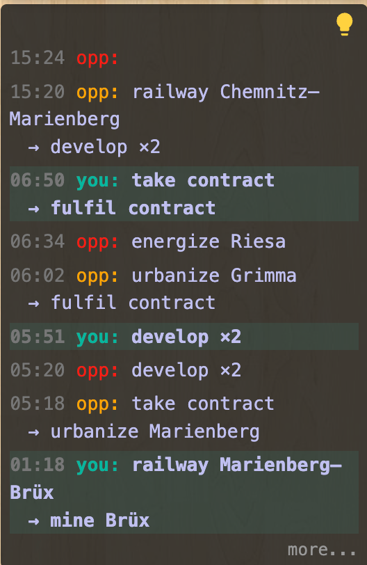
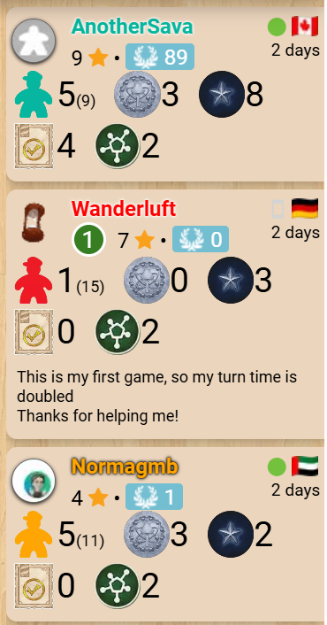
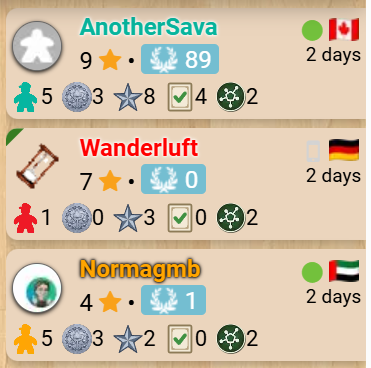

Reads the game log from [Nucleum](https://boardgamegeek.com/boardgame/396790/nucleum) tables with 2-4 players and rewrites it as one line per turn: who was on turn, and which actions they chose. Nucleum keeps nothing secret — tiles, contracts, technologies and the whole map are open — so there is nothing to deduce; what the side panel adds is a record you can scan, with every thaler, worker and income step BGA's own log spells out left off. The same history can replace BGA's log on the table itself.

## Turn history

Each turn is one row. The first action a player took heads the row and the rest sit indented under it, so a turn reads as a single unit however many things happened in it. Every row renders in that player's BGA-assigned colour, your own is highlighted with a subtle background tint, and each carries the time the turn was played.

The actions a row can name:

- **urbanize / mine / turbine** — a building, mine or turbine placed, with the city it went in
- **energize** — a building lit, with the power plant that fed it
- **railway** — a tile placed on the map. When the placement completed the link, the two cities it joined are named; an unfinished link joins nothing yet, so it is left unsaid
- **take contract**, **fulfil contract**, **develop**, **unlock tech**, **recharge**, **nucleum**, **milestone**, **sell uranium** — the remaining choices, with ×N where one was repeated within the turn
- **plays a tile** — a tile went to the player board and both of the actions it offered were skipped, so the turn has nothing else to name
- the **experiment** each player drafted during setup, as the first rows of the game

A turn still being played shows as the player's name alone, and fills in as they act.

Rendered into BGA's own log column, where it stays visible with the side panel closed. The lightbulb switches back to BGA's log, and "more..." widens the window:

## Compact player panels

BGA stacks five resource counters in every player panel — workers, thaler, achievements, contracts,
network — and on a four-player table that is most of a screenful of column. This folds them onto one
line at about half the icon and text size, taking a panel from 78 pixels to 20. The workers left in
the box, shown in brackets after the workers in play, go with them: the board already says, and no
decision reads it. The counters sit a few pixels below the score, with the name and score lines drawn
a little tighter.

All five icons fill the same box, so they stand at one height, and two are redrawn where BGA's carry
detail that turns to mush this small — the achievement token as the faceted star the physical token
is, without the heavy black disc it is embossed on, and the fulfilled contract with its gold ring
dropped and its tick green, since ring and tick are both gold and merge into one smudge at this size.
The contract keeps its frame, which is what makes it read as a contract.

A player on their first game loses the two-line "this is my first game" notice, which costs 52 pixels
of a 74-pixel panel, repeats all game, and explains a doubled clock the panel's own timer already
shows. The first player is marked by a green wedge across the corner of their panel, naming itself on
hover, rather than BGA's green "1" disc — in a game where that never changes hands, the disc spends a
permanent 27 pixels of the score row on a fact that does not move.

BGA's panels, then the folded ones — the same three players in 706 pixels of column and then 368:

## Game features

- **Actions, not their consequences**: every thaler, worker, VP, income step, achievement token and market refill that an action produced is left out. Those are what fill BGA's own log, and they are on the board in front of you
- **Undo-aware**: a cancelled turn is rebuilt rather than shown twice — BGA replays an undone turn from its start, and the row follows it
- **Railway links named**: a placement that completes a link names the two cities it joined, read out of the network resync BGA sends with it
- **Out-of-turn actions attributed**: an action taken during another player's turn — what a railway colour match can hand you — carries that player's name in their colour
- **In BGA's game log**: the same history can render into BGA's own log column, where it stays visible and keeps updating with the side panel closed. The column shows one log or the other, never both; a lightbulb in its header switches between them, and "more..." below the history widens the window for the current table
- **Show player names**: display option switching rows between "you"/"opp" and full player names (persisted across sessions)
- **Compact player panels**: display option folding BGA's five stacked resource counters onto one line, taking a panel from 78 pixels to 20 — see [Compact player panels](#compact-player-panels) above

## Standard features

- **Live tracking**: while the side panel is open, the display automatically updates when the game progresses — a green status dot appears in the status bar
- **Auto-update**: while the side panel is open, switching to another supported game tab automatically extracts and displays its state
- **Status bar**: shows the table number and live tracking indicator
- **Auto-hide**: three-mode toggle controlling side panel behavior — Never (always open), Leaving BGA (closes on non-BGA tabs), Leaving tables (closes when navigating away from supported game tables)
- **Keyboard shortcut**: configurable via `chrome://extensions/shortcuts` to toggle the side panel open/closed
- **Lit icon**: the toolbar icon glows when the active tab has a supported game table open
- **Per-game zoom**: side panel zoom level is saved independently for each game and the help page
- **Compact BGA header**: folds BGA's table info, the current prompt and its action buttons into a single row and trims the bar to fit, reclaiming the vertical space its three stacked rows took; applies to every BGA table, supported game or not, stays frozen at the top while the board scrolls; it is switched from the eye menu on the help page, which also offers "Progression only" — the table number and move count dropped, leaving the percentage in the prompt's own type
- **Pin player panels**: keeps the top of BGA's right column in place while the board scrolls past — under the folded header bar when it is frozen, at the top of the page when it is not. While the turn history is showing in BGA's log column the whole column is pinned, history and view switch included, and scrolls inside itself if it outgrows the window; otherwise the player panels alone are pinned and BGA's log column scrolls away as usual, and panels tall enough to take half the window are left alone. Switched from the eye menu on the help page, and applies to every BGA table, supported game or not
- **Persistent settings**: all toggle states, section visibility, and pin mode are saved across sessions
- **Download**: bundled zip with raw data, game log, game state, and standalone summary — attach this archive with a short description if you notice a bug, and I'll prioritize fixing it!
